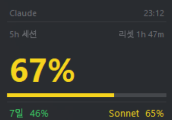

<h1 align="center">Claude Usage Monitor</h1>

<p align="center">
  <i>A lightweight floating overlay that shows your Claude.ai subscription usage in real time.</i>
</p>

<p align="center">
  
  
  
  
  
  
</p>

<p align="center">
  
</p>

<p align="center">
  <a href="#features">Features</a> •
  <a href="#installation">Installation</a> •
  <a href="#configuration">Configuration</a> •
  <a href="#usage">Usage</a> •
  <a href="#faq">FAQ</a> •
  <a href="#disclaimer">Disclaimer</a>
</p>

---

> ### 🪟 Windows only
> This project currently supports **Windows 10 and Windows 11 only**. macOS and Linux are **not** supported at this time — see the [FAQ](#faq) for details.

A tiny always-on-top widget for Claude.ai **Pro / Max / Team** users who want to keep an eye on their quota without opening the settings page every few minutes.

It pins a small, draggable overlay to your desktop showing the 5-hour session utilization, weekly usage, per-model breakdown, and time remaining until the next reset — all refreshed automatically in the background.

## Features

- 🟢 **5-hour session** — current session utilization (%) with a live reset countdown
- 📅 **Weekly usage** — rolling 7-day utilization and reset timer
- 🤖 **Per-model breakdown** — separate 7-day Sonnet utilization
- 💳 **Extra credits** — additional credit usage against your monthly limit
- 🎨 **Status colors** — green (<60%) → yellow (<85%) → red (85%+)
- 🪟 **4 display modes** — Overlay (floating), Tray (notification area), CLI (single-line terminal), Autohide (edge-docked, slide on hover) — switchable at runtime via right-click menu
- 🖱 **Drag to reposition / right-click menu** — refresh / switch mode / quit
- ☁️ **Cloudflare-friendly** — uses `curl_cffi` browser impersonation to bypass challenges
- 🔒 **Credentials separated** — cookies and org ID live in a gitignored `config.ini`

### Display

| Item | Description |
|---|---|
| **5h session** | Current session utilization (%) + time until reset |
| **7d** | 7-day utilization (%) + time until reset |
| **Sonnet** | 7-day Sonnet model utilization (%) |
| **Extra** | Extra credit usage / monthly limit |

## Requirements

- **Windows 10 or 11** (Windows-only — macOS/Linux not supported)
- Python 3.8+
- An active Claude.ai subscription (Pro / Max / Team)

## Installation

```bash
git clone https://github.com/knulps/claude-monitor-win.git
cd claude-monitor-win
pip install curl_cffi pystray Pillow
```

> `pystray` + `Pillow` enable the Tray mode. `tkinter` ships with the official Python for Windows installer.

### Build a standalone executable (optional)

To get a single `claude_monitor.exe` — no Python install needed to run it, and it
shows up as "Claude Usage Monitor" in Windows' notification-area settings:

```bash
pip install pyinstaller
pyinstaller claude_monitor.spec
```

The executable is written to `dist/claude_monitor.exe`. It's built with a console
so CLI mode works; GUI modes hide the console window automatically.

> **Important — config.ini location for the exe:** the exe reads `config.ini` from its own folder, not the project root. After moving `claude_monitor.exe` anywhere you want, copy `config.ini` (with your real cookies and org_id) into the **same folder** as the exe. If `config.ini` is missing, the exe shows an error dialog and exits.

## Configuration

Credentials are read from `config.ini`. Copy the template and fill in your values:

```bat
copy config.ini.example config.ini
```

```ini
[claude]
cookies       = sessionKey=sk-ant-...; cf_clearance=...; ...
org_id        = xxxxxxxx-xxxx-xxxx-xxxx-xxxxxxxxxxxx
poll_interval = 60
```

> `config.ini` is listed in `.gitignore` — your cookies will **not** be committed.

### How to get `cookies`

1. Open [`claude.ai/settings/usage`](https://claude.ai/settings/usage) in your browser.
2. Press <kbd>F12</kbd> → **Network** tab → filter **Fetch/XHR** → press <kbd>F5</kbd> to reload.
3. Click the `/usage` request → open the **Request Headers** section.
4. Copy the **entire** value of the `cookie:` header (including Cloudflare cookies such as `cf_clearance` and `__cf_bm`).

> ℹ️ Cloudflare cookies like `cf_clearance` expire within hours or days. If you start seeing `403`s, re-extract the cookie string.

### How to get `org_id`

1. In the same Network tab, look at the URL of the `/usage` request.
2. It follows the pattern `/api/organizations/{UUID}/usage` — copy the **UUID** part.

## Display Modes

The monitor supports four interchangeable modes. The active mode is saved in `config.ini` (`[ui] mode = ...`) and can be switched at runtime from the right-click menu.

| Mode | What it looks like | When to use |
|---|---|---|
| `overlay` (default) | Small always-on-top floating panel in the bottom-right corner | You want the numbers visible at all times. |
| `tray` | Color-coded icon with % in the Windows notification area; left-click for popup; hover for tooltip | You don't want the desktop covered. Glance occasionally. |
| `cli` | Single ANSI-colored line in your terminal, redrawn every poll | You live in a terminal anyway. Press `q` + Enter to quit. |
| `autohide` | Floating window docked to a screen edge; only a 3px peek strip is visible; hover to slide in | You want zero permanent visual footprint but instant access. |

Override the mode at launch with `--mode <name>` (e.g., `python claude_monitor.py --mode tray`). Use `--no-save-mode` to prevent runtime switches from being persisted to `config.ini`.

> **CLI mode** requires a visible console — run with `python.exe`, not `pythonw.exe`. Switching to CLI from another mode is blocked (with a message) if no console is attached. CLI mode has no right-click menu, so to leave it press `q` and relaunch with another `--mode`.

> **Tray mode:** if the icon is hidden in the `^` overflow, right-click it → "Always show icon (Windows settings)". In the Settings window that opens, expand **"Other system tray icons"** and turn on **"Claude Usage Monitor"**.

## Usage

```bash
python claude_monitor.py
```

The overlay appears in the bottom-right of your screen. Drag it anywhere you like.

### Controls

| Action | Result |
|---|---|
| Left-click & drag | Move the window |
| Right-click | Open refresh / quit menu |

Auto-refresh: the API is polled every `poll_interval` seconds (default 60), and the countdown updates once per minute.

### Run on Windows startup (optional)

To launch automatically at boot:

1. Edit the bundled `claude_monitor.bat` so the paths match your install location.
2. Press <kbd>Win</kbd>+<kbd>R</kbd> → enter `shell:startup` → drop a shortcut to the `.bat` into the folder that opens.

It uses `pythonw`, so it runs silently in the background without a console window.

## FAQ

<details>
<summary><b>I'm getting <code>403 Forbidden</code> / a Cloudflare challenge.</b></summary>

- Make sure `curl_cffi` is installed (`pip install curl_cffi`).
- Confirm you copied the **full** cookie string, including Cloudflare cookies (`cf_clearance`, `__cf_bm`).
- Your cookies may have expired — re-extract them and paste the new value into `config.ini`.
</details>

<details>
<summary><b>The numbers show only <code>—</code>.</b></summary>

Check the console for `[fetch error]` output. It's usually an expired cookie or a typo in `org_id`.
</details>

<details>
<summary><b>Does it work on macOS / Linux?</b></summary>

**No — this project is Windows-only today.** The Tkinter code itself is fairly portable, but `overrideredirect`, alpha blending behavior, and the startup-registration flow all need per-OS testing and tweaks. PRs that add macOS/Linux support are very welcome.
</details>

<details>
<summary><b>Are my cookies safe?</b></summary>

Cookies are stored **only in your local `config.ini`** and are sent exclusively to the official Anthropic endpoint (`claude.ai/api/organizations/.../usage`). The full source is under 300 lines — feel free to audit it yourself.
</details>

<details>
<summary><b>The tray icon shows the wrong number / wrong color.</b></summary>

The tray icon updates each poll cycle (default 60s). The 5-hour session percentage is what's displayed. If you just hit a threshold, wait one cycle, or use the right-click menu → "Refresh now."
</details>

## Disclaimer

This project is **not affiliated with, endorsed by, or sponsored by Anthropic**.
It relies on internal, undocumented endpoints that may change or break at any time. Use at your own risk.

## Contributing

Issues and pull requests are welcome — feature ideas, bug reports, and macOS/Linux ports are all appreciated.

1. Fork and create a feature branch (`feature/your-idea`).
2. Make your changes and commit.
3. Open a PR against `master`.

## License

[MIT](LICENSE) © 2026 [knulps](https://github.com/knulps)
